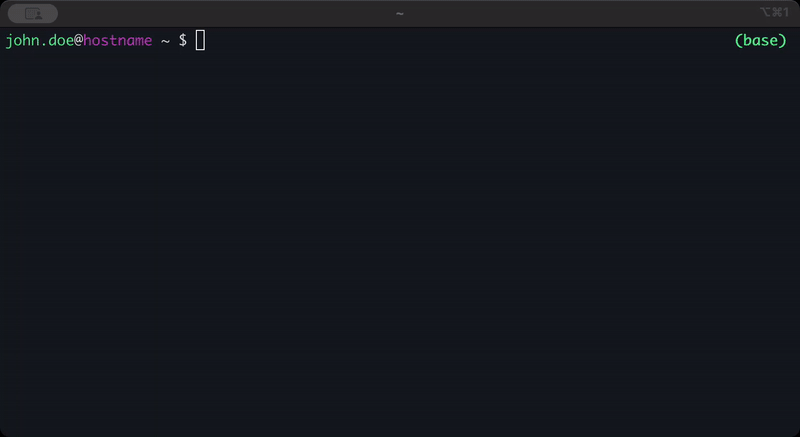

# GPTCLI


[](https://pepy.tech/projects/dbc-gptcli)

GPTCLI is a CLI client written entirely in Python for accessing the LLM of your choice without the need for Web or Desktop apps. All data is encrypted at rest using AES-256-GCM.

## How to run it

Summary:

- **PyPI**:
  - Install with `pip install dbc-gptcli`.
  - Run `gptcli [mistral|openai] [chat|se|ocr]`.
- **Docker**:
  - Pull with `docker pull deathbychocolate/gptcli:latest`.
  - Start a container with `docker run --rm -it --entrypoint /bin/bash deathbychocolate/gptcli:latest`.
  - Run `gptcli [mistral|openai] [chat|se|ocr]`.

For more info on usage, check the builtin help docs with:

- `gptcli -h`
- `gptcli [mistral|openai] [chat|se|ocr] -h`.

### Command tree

```text
gptcli [--no-cache] [--loglevel LEVEL]
├── all
│   ├── encrypt       # Encrypt all cleartext files
│   ├── decrypt       # Decrypt all encrypted files
│   ├── rekey         # Re-encrypt with a new passphrase
│   └── nuke          # Permanently delete all gptcli data
├── mistral
│   ├── chat          # Multi-turn conversation
│   ├── se            # Single exchange
│   ├── ocr           # Document to Markdown conversion
│   └── search
│       ├── chat      # Full-text search over chat history
│       └── ocr       # Full-text search over OCR history
└── openai
    ├── chat          # Multi-turn conversation
    ├── se            # Single exchange
    └── search
        └── chat      # Full-text search over chat history
```

## How to get an API key

You need valid API keys to communicate with the AI models.

For OpenAI:

- Create an OpenAI account here: <https://chat.openai.com/>
- Generate an OpenAI API key here: <https://platform.openai.com/api-keys>

For Mistral AI:

- Create a Mistral AI account here: <https://chat.mistral.ai/chat>
- Generate a Mistral AI API key here: <https://console.mistral.ai/api-keys>

## How it works

The project uses the API of LLM providers to perform chat completions. It does so by sending message objects converted to JSON payloads and sent over HTTPS POST requests.

GPTCLI facilitates access to 2 LLM providers, Mistral AI and OpenAI. Each provider offers modes to communicate with the LLM of your choosing: `Chat`, `Single-Exchange`, and `OCR` (Mistral only).

### Modes

#### Chat

Chat mode allows the user to have a conversation that is similar to ChatGPT by creating a MESSAGE-REPLY thread. For example, you say hello:


You can have a conversation multiline conversations:


You can load the last conversation you had with the LLM provider (OpenAI, Mistral):


And if you want to know about in-chat commands, you can view them by asking for help:



Chat mode also automatically:

- Stores chats locally as oneline `json` files via the `--store` and `--no-store` flags.
- Uses previously sent messages as context via the `--context` and `--no-context` flags.
- Loads the provider's API key; you may overwrite this behaviour by providing a different key with the `--key` flag.

#### Single-Exchange (SE)

Single-Exchange is functionally similar to chat mode, but it only allows one exchange of messages to happen (1 message sent from client-side and 1 response message from server-side) and then exit. This encourages loading all the context and instructions in one message. It is also more suitable for automating multiple calls to the API with different payloads, and flags. This mode will show you output similar to the following:


This mode does not store chats locally. It is expected the user implements their own solution via piping or similar.

#### OCR (Optical Character Recognition)

OCR mode converts documents (PDFs, images) into Markdown text. Currently available for Mistral AI only. It accepts local filepaths and/or URLs as arguments, or a batch of documents via `--filelist`. By default, results are saved as Markdown files in the current directory.

OCR mode also automatically:

- Stores OCR results locally via the `--store` and `--no-store` flags.
- Saves converted Markdown files to the current directory; you may change this with `--output-dir` or disable it with `--no-output-dir`.
- Supports batch processing from a file of paths/URLs via the `--filelist` flag.
- Displays the Markdown result to stdout via the `--display` flag.
- Displays the most recent OCR session from storage via the `--display-last` flag.
- Excludes images from the OCR response via the `--no-images` flag, returning only Markdown text.

#### Search (Full-Text Search)

Search mode provides an interactive TUI for full-text search over locally stored history. It is available for both providers under `chat`, and for Mistral AI also under `ocr`.

```bash
gptcli mistral search chat   # Search Mistral chat history
gptcli openai search chat    # Search OpenAI chat history
gptcli mistral search ocr    # Search Mistral OCR history
```

Type to filter results in real time. Chat search navigation and actions:

| Key | Action |
|-----|--------|
| `↑` / `↓` | Move selection |
| `PgUp` / `PgDn` | Page through results |
| `Enter` | Load session into chat |
| `Ctrl+P` | Print session to stdout |
| `Ctrl+U` | Clear the search query |
| `Esc` | Quit |

OCR search navigation and actions:

| Key | Action |
|-----|--------|
| `↑` / `↓` | Move selection |
| `PgUp` / `PgDn` | Page through results |
| `Enter` | Print result to stdout |
| `Ctrl+W` | Write result to a file |
| `Ctrl+U` | Clear the search query |
| `Esc` | Quit |

For OCR search, the output directory for `Ctrl+W` can be set with `--output-dir` (defaults to `.`).

### Encryption

GPTCLI encrypts all data at rest using AES-256-GCM with scrypt key derivation. On first run, you are prompted to create a passphrase (16 characters minimum). The derived encryption key is cached for 12 hours using a wrapping key in volatile storage, so you don't need to re-enter your passphrase on every invocation.

You can manage encryption across all providers with:

- `gptcli all encrypt` — Encrypt all cleartext files.
- `gptcli all decrypt` — Decrypt all encrypted files.
- `gptcli all rekey` — Re-encrypt all files with a new passphrase.

Use the `--no-cache` flag to disable key caching and prompt for the passphrase every time.

## Features

### Implemented

- [x] Send text based messages to Mistral AI API.
- [x] Send text based messages to OpenAI API.
- [x] Store API keys locally.
- [x] Allow context retention for chats with all providers.
- [x] Allow streaming of text based messages for all providers.
- [x] Allow storage of chats locally for all providers.
- [x] Allow loading of chats from local storage as context for all providers.
- [x] Add in-chat commands.
- [x] Add multiline option for chat mode.
- [x] Add spinner animation for chat mode.
- [x] Add OCR as a new mode.
- [x] Send OCR queries for images and PDF documents to Mistral AI API.
- [x] Allow storage of OCR results locally.
- [x] Add encryption at rest for all locally stored data.
- [x] Add key caching with automatic expiry.
- [x] Add passphrase rekeying.
- [x] Add FTS for chats in storage.
- [x] Add FTS for OCR results in storage.
- [x] Add nuke command to permanently delete all gptcli data.

### In Development

- [ ] Send OCR queries for images and PDF documents to OpenAI API.
- [ ] Add role-based messages for Mistral AI:
  `user` `system` `assistant` `developer` `tool` `function`
- [ ] Add role-based messages for OpenAI:
  `user` `system` `assistant` `developer` `tool` `function`

### Lexicon

| Abbreviation | Definition                      |
|--------------|:--------------------------------|
| **OCR**      | Optical Character Recognition   |
| **SE**       | Single-Exchange                 |
| **FTS**      | Full Text Search                |

## How GPTCLI is different from other clients

- GPTCLI does not use any software developed by OpenAI or Mistral AI, except for counting tokens.
- GPTCLI prioritizes features that make the CLI useful and easy to use.
- GPTCLI aims to eventually have all the features of its WebApp counterparts in the terminal.
