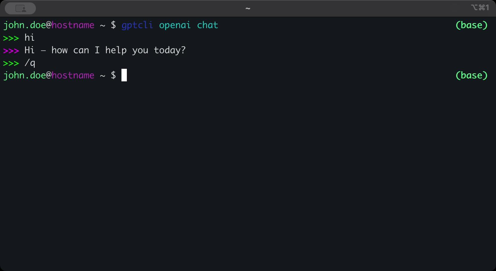
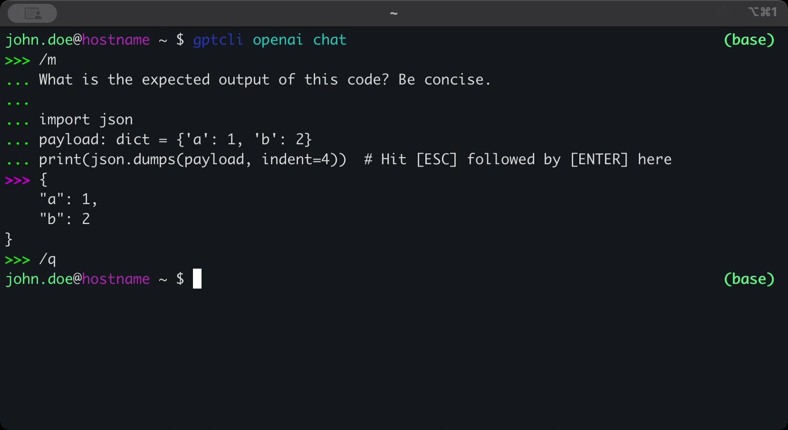
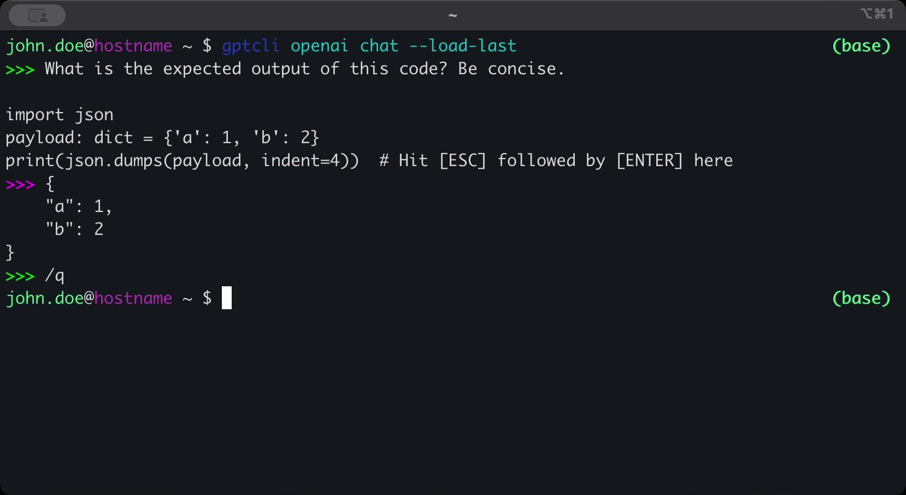
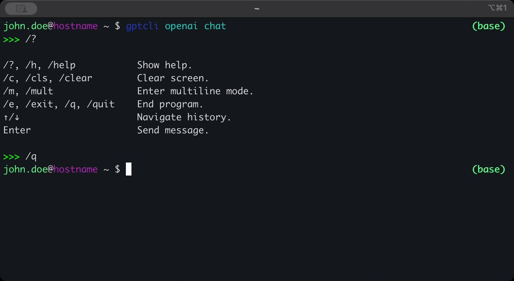
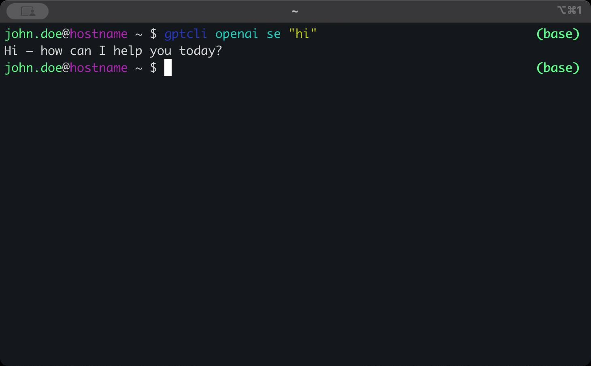

# GPTCLI

GPTCLI is a CLI client written entirely in Python for accessing the LLM of your choice without the need for Web or Desktop apps.

## How to run it

- Pypi:
  - Open your preferred terminal.
  - Install the project via pypi: `pip install dbc-gptcli`.
  - Run `gptcli [mistral|openai] [chat|se]`.
  - For more info on usage, check the builtin help docs:
    - `gptcli -h`
    - `gptcli [mistral|openai] [-h|--help]`
    - `gptcli [mistral|openai] [chat|se] [-h|--help]`.
- Docker:
  - Open your preferred terminal.
  - Start docker via the desktop app or running `sudo systemctl start docker`.
  - Pull the docker image with `docker pull deathbychocolate/gptcli:latest`.
  - Start and enter a container with `docker run --rm -it --entrypoint /bin/bash deathbychocolate/gptcli:latest`.
  - Run `gptcli [mistral|openai] [chat|se]` or `python3 gptcli/main.py [mistral|openai] [chat|se]`.

## How to get an API key

You need valid API keys to communicate with the AI models.

For OpenAI:

- Create an OpenAI account here: <https://chat.openai.com/>
- Generate an OpenAI API key here: <https://platform.openai.com/api-keys>

For Mistral AI:

- Create a Mistral AI account here: <https://chat.mistral.ai/chat>
- Generate a Mistral AI API key here: <https://console.mistral.ai/api-keys>

## How it works

The project uses the OpenAI API to query chat completions. It does so by sending message objects converted to JSON payloads and sent over HTTPS POST requests. For now, GPTCLI is for purely text based LLMs.

GPTCLI facilitates access to 2 LLM providers, Mistral AI and OpenAI. Each provider offers 2 modes to communicate with the LLM of your choosing, `Chat` and `Single-Exchange`:

### Modes

#### Chat

Chat mode allows the user to have a conversation that is similar to ChatGPT by creating a MESSAGE-REPLY thread:

---

Chat mode also allows for multiline correspondence. This is useful in cases where you would like to copy and paste small to medium-large text or code samples; though there is no size limit. You may enter and exit this feature by typing and entering `/m` in the prompt:

---
Chat mode also allows loading of the last chat session as your current session:

---
Chat mode also allows for in-chat commands:

Chat mode also automatically:

- Stores chats locally as oneline `json` files via the `--store` and `--no-store` flags.
- Uses previously sent messages as context via the `--context` and `--no-context` flags.
- Loads the provider's API to environment variables; you may overwrite this behaviour by providing a different key with the `--key` flag.

#### Single-Exchange (SE)

Single-Exchange is functionally similar to chat mode, but it only allows one exchange of messages to happen (1 sent from client-side, 1 response message from server-side) and then exit. This encourages loading all the context and instructions in one message. It is also more suitable for automating multiple calls to the API with different payloads, and flags. This mode will show you output similar to the following:

This mode does not store chats locally. It is expected the user implements their own solution via piping or similar.

## Features

### Implemented

- [x] Send text based messages to Mistral AI API.
- [x] Send text based messages to OpenAI API.
- [x] Store API keys locally.
- [x] Allow context retention in the form of chats for all providers.
- [x] Allow streaming of text based messages for all providers.
- [x] Allow storage of chats locally for all providers.
- [x] Allow loading of chats from local storage as context for all providers.
- [x] Add in-chat commands.
- [x] Add multiline option for chat mode.

### In Development

- [ ] Add OCR as a new mode.
- [ ] Send OCR queries for images and text to Mistral AI API.
- [ ] Send OCR queries for images and text to OpenAI API.
- [ ] Allow storage of OCR results locally.
- [ ] Add FTS for chats in storage.
- [ ] Add FTS for OCR results in storage.
- [ ] Add role-based messages for Mistral AI:
  `user` `system` `assistant` `developer` `tool` `function`
- [ ] Add role-based messages for OpenAI:
  `user` `system` `assistant` `developer` `tool` `function`

### Lexicon

| Abbreviation | Definition                      |
|--------------|:--------------------------------|
| **OCR**      | Optical Character Recognition   |
| **FTS**      | Full Text Search                |

## How GPTCLI is different from other clients

- GPTCLI does not use any software developed by OpenAI or Mistral AI, except for counting tokens.
- GPTCLI prioritizes features that make the CLI useful and easy to use.
- GPTCLI aims to eventually have all the features of its WebApp counterparts in the terminal.
